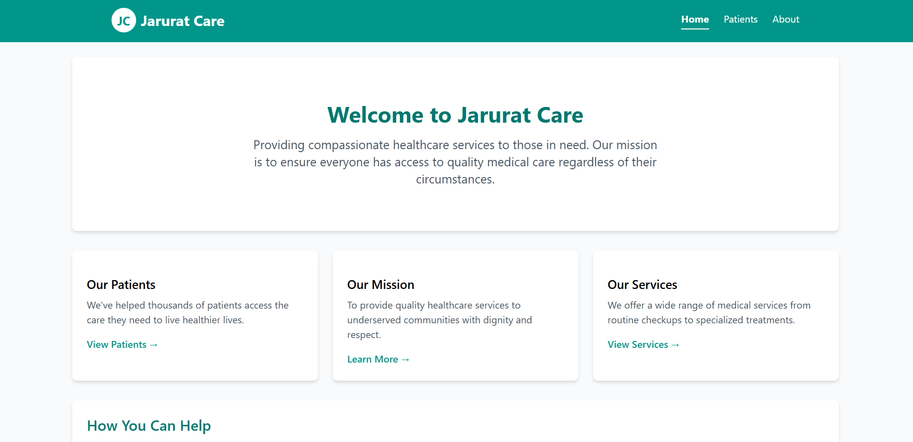
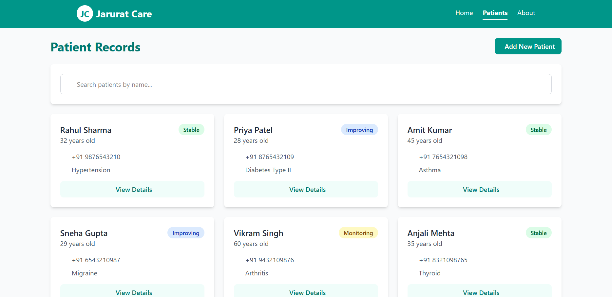
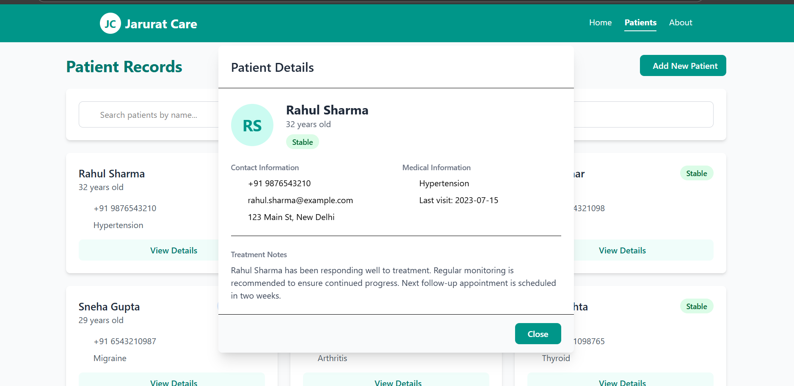
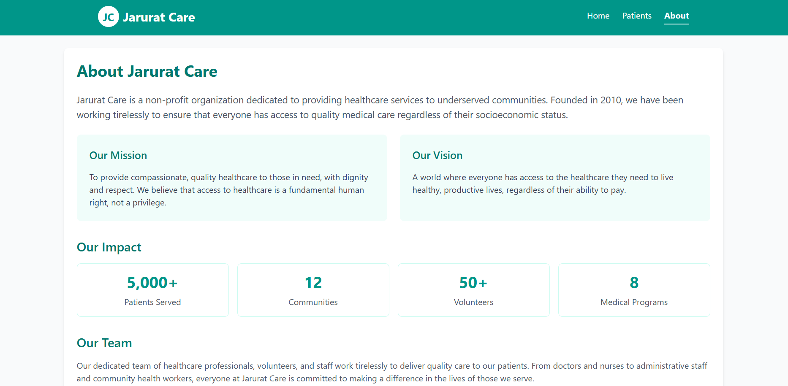

# 🩺 Jarurat Care - Patient Records Dashboard

A clean and easy-to-use **patient management system** built with React, designed for healthcare NGOs to **manage and track patient records efficiently**.

---

## 🌍 Live Demo
Check out the live project here: [Jarurat Care Dashboard](https://jarurat-care-project.netlify.app/)

---

---

## ✨ Features
- 🗂 **View all patients** in a clean card layout
- 🔍 **Search patients by name** using a responsive search bar
- 📖 **View detailed patient information** in a modal
- ➕ **Add new patients** to the system
- 📱 **Responsive design** for desktop and mobile

---

## 🚀 Getting Started

### **Prerequisites**
Make sure you have the following installed:
- [Node.js](https://nodejs.org/)
- npm (comes with Node.js)

---

### **Installation**
1. **Clone the repository**  

   git clone https://github.com/1508vansh/Jarurat-Care-.git
   cd jarurat-care

## Running the App

**To start the development server:**

- npm start

The app will open automatically at localhost

## Building for Production

**To create an optimized production build:**

- npm run build

This will generate files inside the build folder that can be deployed to any hosting service like Vercel, Netlify, or GitHub Pages.

--- 

## 🛠 Technologies Used

- ⚛ React.js – UI library

- 🗃 Redux Toolkit – State management

- 🎨 Tailwind CSS – Styling

- 🌐 React Router – Navigation

- 📦 Parcel - Bundler

---

## 📸 Screenshots

### 🏠 Home Page

### 🧾 Patients Page

### 🗂 Patient Details Modal

### 🧾 About Page

## 📜 About

This project was created as part of an internship assignment for Jarurat Care.
